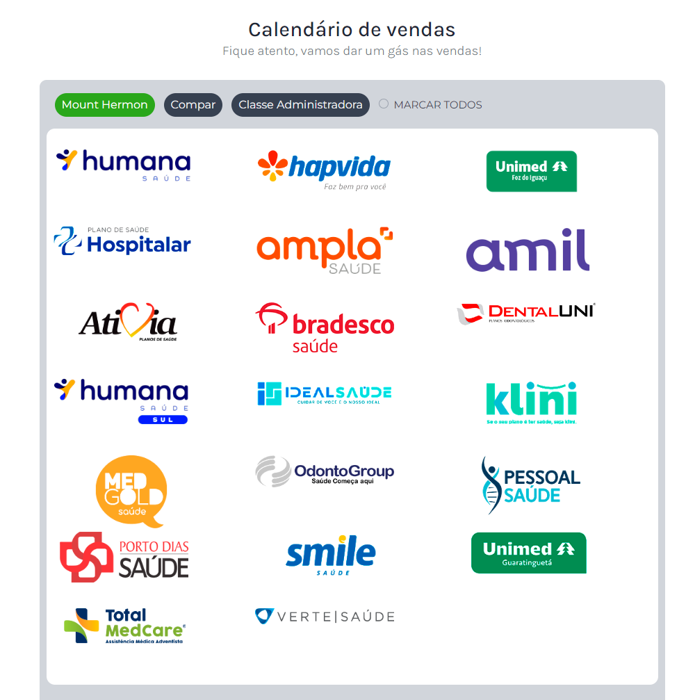

<h1 align="center"> Gerenciador de Vigências </h1>

Uso exclusivo e restrito a empresa Mount Hermon Administradora de benefícios  
<a href="https://vigencias.mounthermon.com.br">Visualize o gerador de PDF com as vigências clicando aqui!</a>

  <a href="#-tecnologias">Tecnologias</a>&nbsp;&nbsp;&nbsp;|&nbsp;&nbsp;&nbsp;
  <a href="#-projeto">Projeto</a>&nbsp;&nbsp;&nbsp;|&nbsp;&nbsp;&nbsp;
  <a href="#memo-licença">Licença</a>&nbsp;&nbsp;&nbsp;|&nbsp;&nbsp;&nbsp;
  <a href="#memo-licença">Time</a>

  

 

  

## 🚀 Tecnologias

Esse projeto foi desenvolvido com as seguintes tecnologias:

- HTML e CSS
- Bootstrap
- JavaScript
- Node.JS
- Banco de dados MySQL
- Git e Github

## 💻 Projeto

O Gerenciador possui acesso interno para o gerenciamento das operadoras e vigências, com opções de inclusão, exclusão e adição de operadoras e também alteração das vigências que normalmente ocorre uma vez ao mês. 

Dentro da área de operadoras é possível fazer upload de logo e carrega-la para uso na operadora selecionada.

- [Acesse o projeto finalizado, online](https://vigencias.mounthermon.com.br)

## 📝 Licença

USO COM RESTRIÇÕES!

Esse projeto é de propriedade exclusiva da Mouth Hermon.
Entretando o uso da lógica e funcionalidade desde que não utilize a identidade visual é livre.

---

## 🤝 TIME

Feito por [Pablo Petelak - Backend 👽](https://pablopetelak.com) enquanto DEV da [Mídia Ideal](https://midiaideal.com.br) 

E [Maria Almeida - Front 🐀](https://github.com/mariak-fla) enquanto DEV da [Mídia Ideal](https://midiaideal.com.br)

